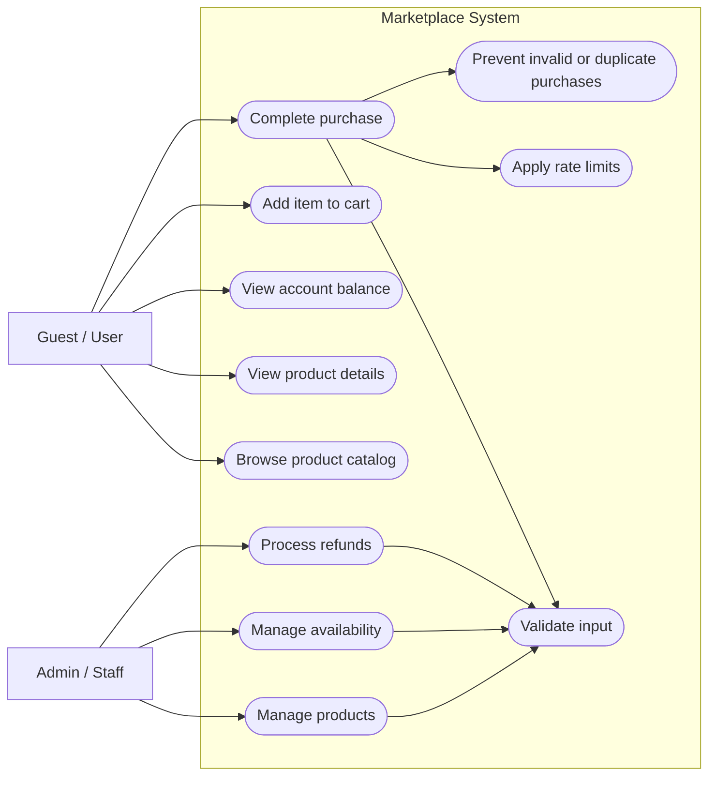

# Architecture Diagram

This document contains the first architecture artifact for the project: a use case diagram and the current backend direction.

## Current Backend Style

The project is currently planned as a modular monolith:

- one deployable backend application
- one primary database
- separate domain modules inside the codebase
- future option to extract modules into services if scale or team structure requires it

This choice keeps checkout, balance updates, transaction logging, and refund logic easier to implement with strong consistency.

## Use Case Diagram

### Mermaid Version



### Plain Text Version

```text
                    +-----------------------------------+
                    |         Marketplace System        |
                    +-----------------------------------+

Guest / User        | Browse product catalog            |
    |-------------->| View product details              |
    |-------------->| View account balance              |
    |-------------->| Add item to cart                  |
    |-------------->| Complete purchase                 |
    |-------------->| View transaction history          |

Admin / Staff       | Manage products                   |
    |-------------->| Manage availability               |
    |-------------->| Process refunds                   |
    |-------------->| View transaction history          |

System checks       | Validate input                    |
(during purchase    | Apply rate limits                 |
and admin actions)  | Prevent invalid/duplicate buys   |
```

## Actors

- `Guest / User`: browses the catalog, checks balance, buys digital items, and reviews transaction history.
- `Admin / Staff`: manages products, controls availability, and handles refunds.

## Notes

- The system only supports digital products or services.
- Purchases use internal platform currency.
- Anti-abuse checks are part of sensitive flows such as checkout and admin actions.
- If your editor does not render Mermaid, use the plain text diagram above or open the Markdown preview.


## What we need to store:


## End points:

### Get product
* `POST /itmes/add`
* `GET /itmes/{id}`
* `GET /itmes?page=1&limit=4`

### Get finance

* `POST /transaction/register`
* `GET /transaction/{id}`
* `GET /mony/user/{id}`
* `GET /mony`

### Get user
* `GET /user/register`
* `GET /user/login`
* `GET /user/{name}`

### Current implemented endpoints

#### Product
* `POST /itmes/add`
* `GET /itmes/{id}`
* `GET /itmes?page=1&limit=4`

#### Finance
* `GET /mony/user/{id}`

#### Auth / User
* `GET /auth/42/login`
* `GET /auth/42/callback`

#### Docs
* `GET /swagger`
* `GET /swagger/`
* `GET /swagger/openapi.json`
